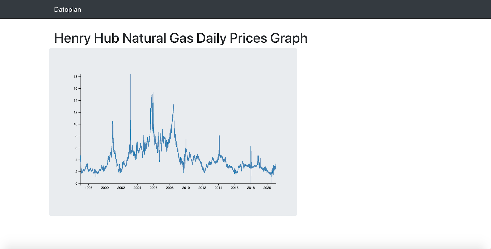

# Datopian Technical Test 




# Install and Use front-End
## Tools
 - React Js
 - D3 js
 - Boostrap  and react boostrap

## To run
  ```
  $ git clone https://github.com/hamzzy/datopian-test.git
  ```
  ```
  $ yarn install or npm install
  ```
  ```
  $ yarn start or npm start
  ```


# Script to create CSV files
## Tools
- Python3
- csv
- requests


### To run app
```
$ cd  data
```
```
$ python3 create_dailyprice.py
```